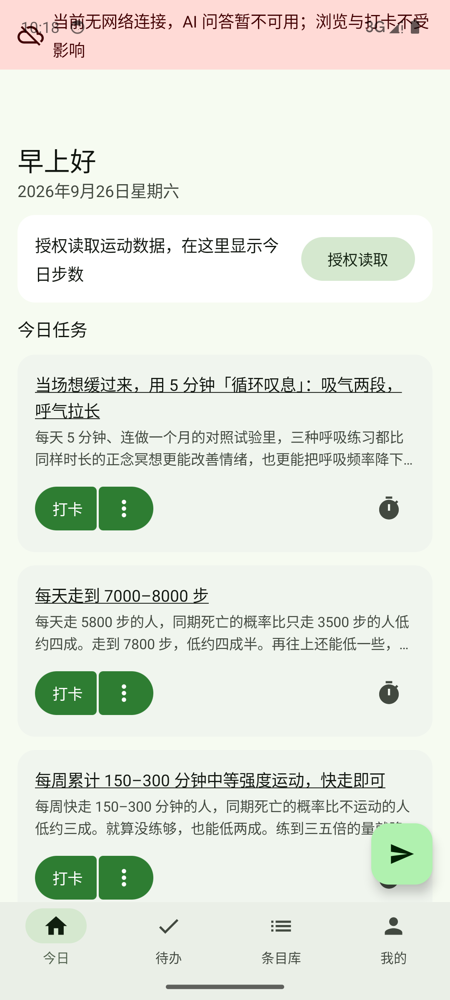
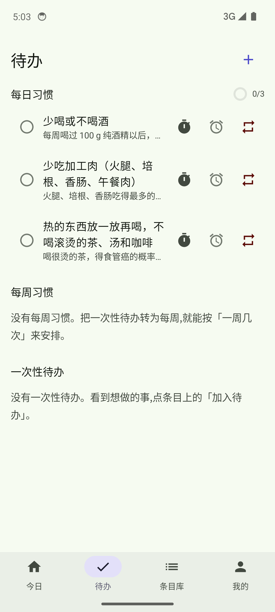
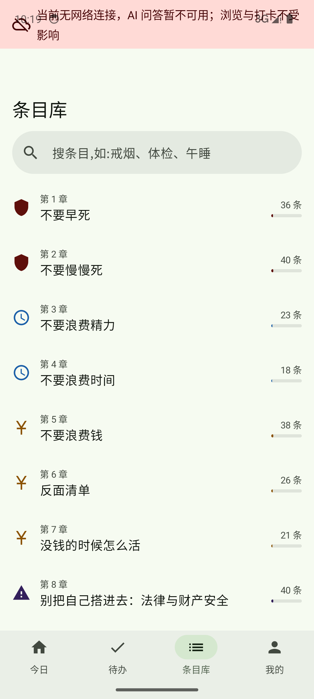
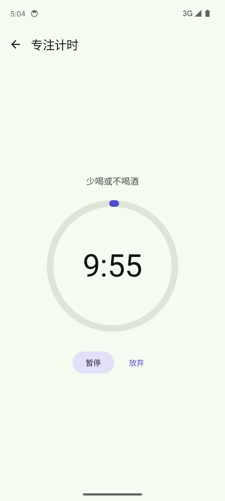
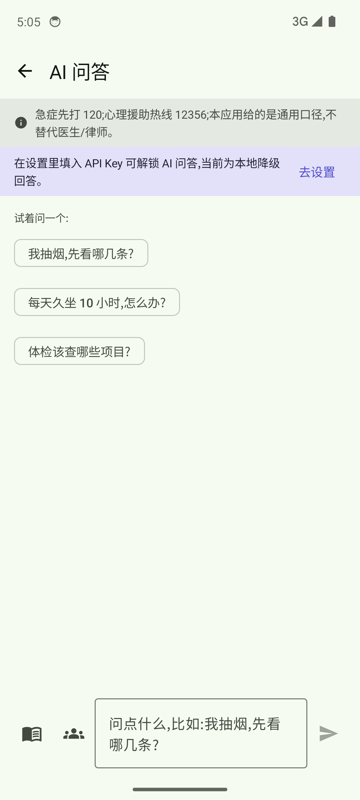

# BetterLifeApp 高性价比人生助手

一款 Android 原生 APP,基于《高性价比人生指南》(github.com/eternity4719/HowToLiveBetter)的 614 条建议,回答一个问题:**你现在该把精力放在什么事情上。**

- 填写一份个人档案(年龄段、吸烟/饮酒、运动睡眠、慢性病、职业、家庭、目标)
- APP 按书中条目的性价比档和证据等级,结合档案给出**该做什么、不该做什么**的推荐
- 每天都要做的事(运动、饮食、睡眠)放进**每日习惯**,打卡记连续天数;首次使用给 3 条示例,可删可改
- 一次性的行动项(换低钠盐、约体检)进**待办列表**,可设截止日和提醒
- 内置 AI 问答(自带 API Key,Kimi/DeepSeek),答案基于书中条目并注明出处

> 内容给的是通用口径,不替代医生、律师、会计。

## 功能一览

| 页面 | 说明 |
| --- | --- |
| 档案向导 | 四步填写:基本情况 → 健康习惯 → 家庭与计划 → 目标,除年龄段外都可跳过;也可「先随便看看」直接进入,空档案照样出推荐,档案由「每日一问」渐进补齐 |
| 今日 | 每日习惯打卡(连续天数、请假不断签)+ 今日步数卡片 + 按口径分组的推荐(先保命/守住钱/省精力/别踩线,已打卡/已加入计划的自动去重,可「换一批」) |
| 待办 | 每日/每周习惯 + 一次性待办三分区;支持截止日、单任务提醒、补昨天的卡 |
| 条目库 | 33 章 614 条完整浏览、搜索、六栏详情(成本/说人话/收益/证据/来源/备注);宽屏自动多栏 |
| 专注计时 | 从任意任务发起番茄钟,计时结束可直接打卡 |
| AI 问答 | 本地检索书中条目 + 大模型回答,注明「第 X 节第 Y 条」;无 Key 时降级为规则回答;可切互联网搜索;支持语音输入(识别结果留在输入框,确认后再发);答案来源条目可一键加入待办或每日习惯 |
| 统计 | 连续天数、近 8 周趋势、周/月报告、回顾式成就里程碑;连签 7/30/100 天可生成日签分享图 |
| 长辈模式 | 大字号极简界面,只留「今日 + AI 问答」两个 tab,条目库/待办/统计收进「我的」;首次使用一次性询问(可跳过),设置里随时切换、即时生效 |
| 桌面小组件 | 今日任务一览,桌面一键打卡/撤销 |
| 数据备份 | 本地 JSON 导出/导入,换机不丢打卡记录 |
| 通知提醒 | 每日打卡提醒、步数达标自动核销报喜、久未打开挽回(7 天频控)、每周日晚周报、每日一条书摘(默认关,30 天不重样);各自独立开关,点通知直达对应页面 |
| 设置 | API Key、提醒与推送开关、长辈模式、内容更新、档案修改;主题色(蓝紫/青绿/暖橙/青/Material You/深色)与动效档位收进「高级设置」;关于 |

> 今日步数默认走 Health Connect:Android 14+ 系统内置,旧版本需安装 Health Connect App;
> 小米用户需先在「小米运动健康 → 我的 → 三方资料管理」里开启对 Health Connect 的授权。
> 设备没有 Health Connect 时自动降级为本机计步传感器(需授予「身体活动」权限)。

## 更新知识库

书库内容随上游《高性价比人生指南》持续修订,APP 支持在线更新,**无需重装**:

- **自动**:联网状态下每 24 小时检查一次,只增量下载有变化的条目
- **手动**:设置 → 检查内容更新,立即拉取最新版本
- 条目的新增/修订/下架都会同步;你的打卡、收藏、笔记通过稳定 key(外加标题相似度兜底)自动挂到更新后的条目上,**已有记录不受内容更新影响**;下架条目保留快照并标注,浏览与推荐中自动剔除

## 界面截图

| 今日 | 待办 | 条目库 | 专注计时 | AI 问答 |
| --- | --- | --- | --- | --- |
|  |  |  |  |  |

## 技术栈

Kotlin + Jetpack Compose(Material 3)· Room · DataStore · WorkManager · Navigation Compose · OkHttp · Kotlinx Serialization。
最低 Android 8.0(API 26),目标 Android 16(API 36)。

## 文档

- [docs/BUILD.md](docs/BUILD.md):构建环境、打包与签名、CI、内容管线与发布流程
- [docs/DESIGN.md](docs/DESIGN.md):详细架构与二次开发指引
- [docs/DESIGN_SYSTEM.md](docs/DESIGN_SYSTEM.md):设计系统与 M3 Expressive 改造路线
- [todo.md](todo.md):**接下来该做什么**(发布前必须项、已知缺口与「不要做的事」)

## 内容出处与许可

条目内容来自《高性价比人生指南》,版权归原作者所有,按其仓库 LICENSE 使用;APP 关于页已注明出处。本仓库代码与书中内容各自遵循其许可。
